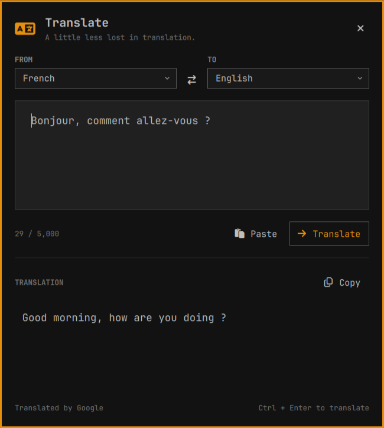

# BarTranslate for Omarchy

[](https://github.com/tcballard/omarchy-badges)

A native translation panel attached to your Omarchy bar. Uses your current theme’s colours, fonts, borders, buttons and searchable language selectors.



Inspired by [Thijmen Dam’s BarTranslate](https://github.com/ThijmenDam/BarTranslate), built with [Build Omarchy Plugins](https://github.com/tcballard/build-omarchy-plugins). The interface is entirely QML inside Omarchy; Google supplies translation data only.

## Use

- Click the translation icon to open or close the panel.
- Type text, select languages, and press **Translate** or **Ctrl+Enter**.
- **Right-click** the icon or press **Paste** to bring in clipboard text. It is sent only when you press Translate.
- Use **Copy** for the translation and the swap button to reverse languages.
- **Escape** or an outside click dismisses the panel and cancels an active request.

Includes language detection and 45 searchable target languages. After translation, the source selector shows the detected language. A bundled local character model checks short text when Google returns it unchanged with low confidence; ambiguous cases ask you to select a source language. Text and translation stay in memory while the widget is loaded; no translation history is written to disk. Your active Omarchy theme controls the panel appearance, including transparency.

Translations require internet access. Clicking Translate sends the entered text to Google’s public translation endpoint. No API key is required. This endpoint is unofficial and can change or rate-limit requests; errors are shown inside the panel. There is no browser/webview, remote page styling, automatic clipboard monitoring, or automatic translation while typing.

## Installation

Requires Omarchy 4/Quattro, Python 3 and `wl-clipboard` (normally installed on Omarchy). No GTK or WebKit dependencies.

Install from GitHub:

```bash
omarchy plugin add https://github.com/tcballard/omarchy-plugin-translate --enable
```

For local development, with this checkout at `~/Source/omarchy-bartranslate`:

```bash
ln -s "$HOME/Source/omarchy-bartranslate" "$HOME/.config/omarchy/plugins/io.github.tcballard.bartranslate"
omarchy-shell shell rescanPlugins
# Wait for the shell rescan, then:
omarchy plugin enable io.github.tcballard.bartranslate --section right
```

The symlink command refuses an existing destination. During local development, rescan plugins after editing the checkout. The source repository is [tcballard/omarchy-plugin-translate](https://github.com/tcballard/omarchy-plugin-translate). No tagged release or marketplace listing is claimed.

## Commands

```bash
omarchy-shell shell toggle io.github.tcballard.bartranslate
omarchy-shell shell hide io.github.tcballard.bartranslate
omarchy-shell io.github.tcballard.bartranslate clipboard
omarchy-shell io.github.tcballard.bartranslate demo
```

The clipboard command opens and pastes; translation remains explicit. The demo is labelled and contains a fixed sample. Global keybindings are not installed automatically.

## Verification

```bash
./tests/run
omarchy plugin validate .
```

See [verification](docs/verification.md) and [design](docs/design.md). The supplied Workbench definition supports optional project registration and validation.

## Remove

For a normal GitHub installation:

```bash
omarchy plugin remove io.github.tcballard.bartranslate
```

For the local development symlink:

```bash
omarchy plugin disable io.github.tcballard.bartranslate
unlink "$HOME/.config/omarchy/plugins/io.github.tcballard.bartranslate"
omarchy-shell shell rescanPlugins
```

These commands preserve the source checkout. Disabling unloads the widget and its request process. No translation history or browser profile needs cleanup.

GPL-3.0-only. See [LICENSE](LICENSE) and [NOTICE](NOTICE).
